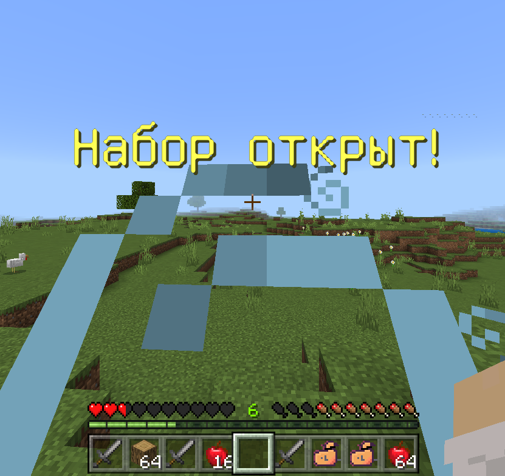
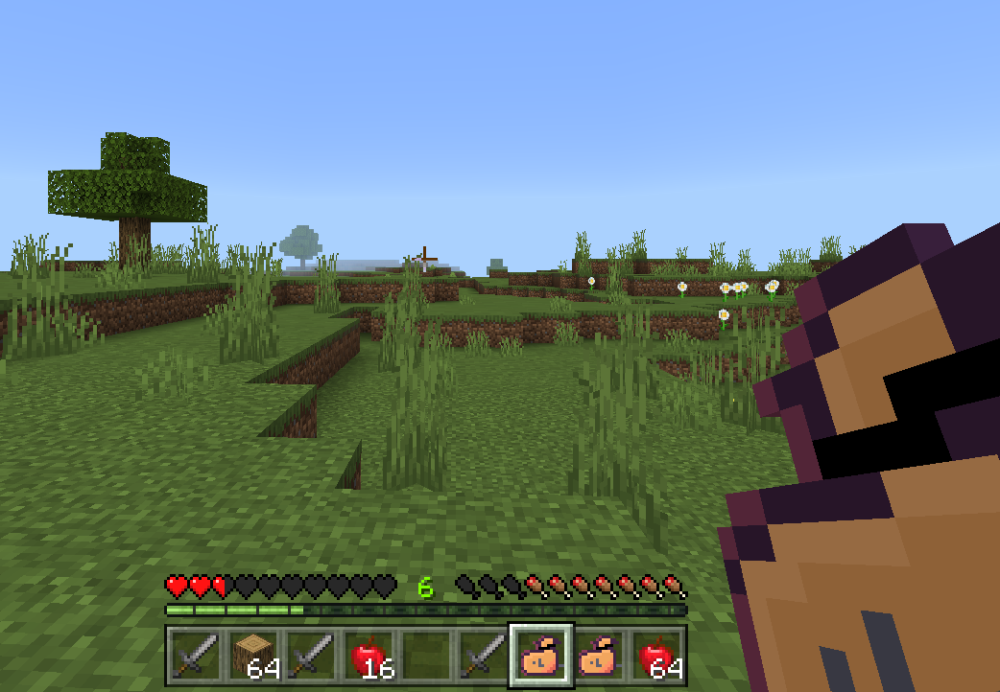

# 🎁LootBag Plugin!

| Description | Language |
| ----------------- | --------------------------- |
| Native language                       |    C++  |
| Native language of the plugin content |    RU   |

😋 This is a default kit start, but using addon for implement functionality.

✨ Configure your items by items.json file!

-----

Releases <a href="https://github.com/MineCoder77/LootBagPlugin/releases/tag/LootBagPlugin">here</a>.

Addon <a href="https://github.com/MineCoder77/LootBagAddon">here</a>.

-----

# 💎 My huge diamond thanks for using this code!
